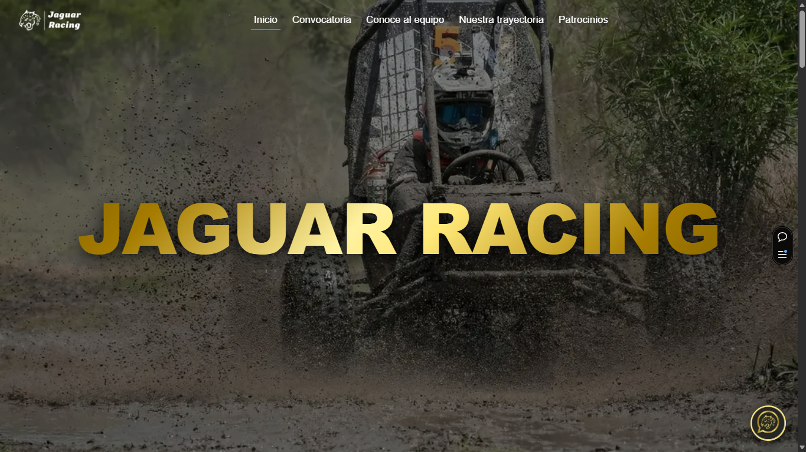

<div align="center">
  
  <br/>
  <h1>Jaguar Racing Pagina Web</h1>
  <p>
    <b>Actualización digital para la Escudería ESIME Azcapotzalco</b>
  </p>

  <a href="https://nodejs.org">
    
  </a>
  <a href="https://vercel.com">
    
  </a>
  <a href="https://azure.microsoft.com">
    
  </a>
  <a href="https://redis.io">
    
  </a>
  <a href="https://ejs.co">
    
  </a>
  <a href="https://vercel.com/analytics">
    
  </a>
</div>

<br/>

[](https://jaguar-racing.vercel.app)
> *Clic en la imagen para visitar la plataforma oficial.*

---

## 🚀 Visión General

Sistema web integral diseñado para la transformación digital de los procesos administrativos y de difusión de Jaguar Racing. Centraliza el reclutamiento de nuevos miembros, la captación de patrocinios mediante una interfaz profesional y automatiza la atención de dudas frecuentes.

La plataforma implementa una arquitectura **Serverless** de alto rendimiento en Vercel, integrando un **Asistente Virtual (IA)** activo 24/7 para reducir la carga operativa del equipo.

## ✨ Características Clave

| Característica | Descripción Técnica |
| :--- | :--- |
| 🤖 **AI-Powered Chatbot** | Asistente inteligente potenciado por **Azure OpenAI (GPT-4o-mini)**. Utiliza ingeniería de prompts ("System Prompt") para filtrar temas irrelevantes y ofrecer respuestas técnicas precisas. |
| 🛡️ **Smart Security** | Protección contra ataques DDoS y control de costos mediante **Rate Limiting** distribuido con **Upstash Redis** (<10ms latencia), limitando peticiones por IP y usuario. |
| ⚡ **High Performance SSR** | Renderizado del lado del servidor (SSR) utilizando **EJS**, garantizando optimización SEO inmediata y tiempos de carga nulos para assets estáticos gracias al caché en Edge Network. |
| ☁️ **Serverless Architecture** | Infraestructura desplegada en **Vercel** con funciones Node.js (v24) que escalan a cero, logrando una eficiencia de costos total ($0 en inactividad). |
| 📊 **Real-time Analytics** | Tablero de observabilidad integrado con **Vercel Analytics**. Monitoreo de sesiones, geolocalización de visitantes y métricas de rendimiento (Web Vitals) con historial de 30 días. |

## 🛠️ Arquitectura del Sistema

El sistema utiliza una arquitectura **Serverless Híbrida** desacoplada. El contenido estático se sirve directamente desde la **Vercel Edge Network** (CDN), mientras que la lógica de negocio y la IA se ejecutan en **Serverless Functions** efímeras que solo despiertan bajo demanda.

<div align="center">
  
</div>

## 📂 Estructura del Proyecto

El proyecto sigue una estructura modular para separar la lógica de servidor de la vista:

```bash
JAGUAR-RACING-VERCEL/
├── public/           # Archivos estáticos (CSS BEM, Imágenes, JS Cliente)
├── views/            # Plantillas EJS para Renderizado en Servidor (SSR)
├── data/             # Base de datos ligera (JSON) para miembros del equipo
├── server.js         # Entry Point: Configuración de Express y Endpoints API
└── vercel.json       # Configuración de Serverless Functions y Rutas
```


## 💻 Instalación y Configuración

1. **Clonar el repositorio**
   ```bash
   git clone https://github.com/tu-usuario/jaguar-racing-web.git 
   ```

2. **Instalar dependencias**
    ```bash
      npm install

    ```


3. **Variables de Entorno (.env)**
    Crea un archivo `.env` en la raíz con las siguientes credenciales:
    ```env
    AZURE_OPENAI_API_KEY=tu_api_key
    AZURE_OPENAI_ENDPOINT=tu_endpoint
    KV_REST_API_URL=tu_redis_url
    KV_REST_API_TOKEN=tu_redis_token

    ```


4. **Ejecutar localmente**
    ```bash
    npm run dev

    ```


## Créditos

Desarrollado por el área de Redes de **Jaguar Racing (ESIME Azcapotzalco)**.
Proyecto impulsado por tecnologías de **Microsoft Azure for Students** y **Vercel Education**.

# Astro Starter Kit: Minimal

```sh
npm create astro@latest -- --template minimal
```

> 🧑‍🚀 **Seasoned astronaut?** Delete this file. Have fun!

## 🚀 Project Structure

Inside of your Astro project, you'll see the following folders and files:

```text
/
├── public/
├── src/
│   └── pages/
│       └── index.astro
└── package.json
```

Astro looks for `.astro` or `.md` files in the `src/pages/` directory. Each page is exposed as a route based on its file name.

There's nothing special about `src/components/`, but that's where we like to put any Astro/React/Vue/Svelte/Preact components.

Any static assets, like images, can be placed in the `public/` directory.

## 🧞 Commands

All commands are run from the root of the project, from a terminal:

| Command                   | Action                                           |
| :------------------------ | :----------------------------------------------- |
| `npm install`             | Installs dependencies                            |
| `npm run dev`             | Starts local dev server at `localhost:4321`      |
| `npm run build`           | Build your production site to `./dist/`          |
| `npm run preview`         | Preview your build locally, before deploying     |
| `npm run astro ...`       | Run CLI commands like `astro add`, `astro check` |
| `npm run astro -- --help` | Get help using the Astro CLI                     |

## 👀 Want to learn more?

Feel free to check [our documentation](https://docs.astro.build) or jump into our [Discord server](https://astro.build/chat).
